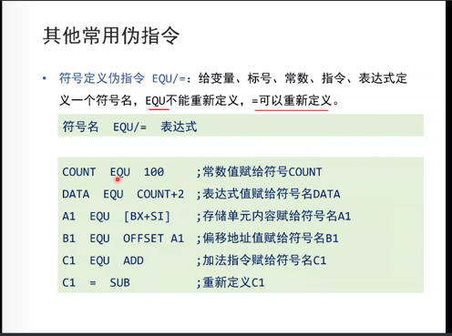

1. mov 【目的操作数】，【源操作数】
   1. 目的操作数必须是其在内存或寄存器中 源操作数可以为立即数 内存 寄存器
   2. 目的操作数和源操作数长度必须一致，可由目的和源中的任意确认，若两者都有确认则该确认必须一致，若两者都无确认则必须指明 如mov word ptr 表示传输一个字  mov byte ptr 传输一个字节 
   3. 立即数不可以直接存储进内存，需用使用通用寄存器做桥梁，同时段寄存器也需要通用寄存器做桥梁

2. sub 【目的操作数】，【源操作数】
   1. 目的操作数=目的操作数 —源操作数
   1. 大小写转化问题 ，大小写字母之间其ASCII差20h,小写转大写：sub al ，20h

3. add 【目的操作数】，【源操作数】
   1. 目的操作数=目的操作数 +源操作数

4. 【BX】
   1. 以寄存器【BX】中存储的值作为默认段地址DS的偏移地址
   2. 其内也可以为常量

5. （内存地址）
   1. 对该内存地址的内存单元进行取数据

6. loop 标号
   1. 其执行需要进行操作：
      1. （cx）=（cx）-1
      2. 如果转移 IP=IP+8(短转移)
      3. 判断（cx）中的值，不为零跳转循环开头执行，为零则跳出循环向下执行

7. 段前缀
   1. 显式的使用默认段地址，eg：mov ax，ds：[bx]

8. and ax，立即数/寄存器

   1. 逻辑按位与
   2. 设置目的寄存器特定位为0

9. or ax，立即数/寄存器

   1. 逻辑按位或
   2. 设置目的寄存器特定位为1

10. inc ：自增一个运算法

11. div reg/内存单元（除数）

    1. 除数可以为八位和十六位，显式给出
    2. 被除数是除数的2倍。
       1. 若被除数为16位，则被除数默认存储在AX中，
       2. 若被除数为32位，则高位存储在DX中，低位存储在AX中
    3. 结果 与被除数位数相同   低位存商 高位存余数
       1. 若除数为8位，则AL存储除法操作的商，AH存储除法操作的余数，
       2. 若除数为16位，则AX存储除法的商，DX存储除法操作的余数

12. mul reg/内存单元（乘数）

    1. 相乘位数相同
       1. 8位：一个乘数隐含在AL中，另一个显式给出，结果 默认AX（16位）
       2. 16位：一个乘数隐含在AX中，另一个显式给出，结果高位存储 DX，低位存储AX

13. jmp ax/CS:IP

    1. 转移
       1. 段内转移：只修改IP    jmp short 标号
          1. 短转移 IP修改范围：-128-127
          2. 近转移 IP修改范围 ：-32768-32767
       2. 段间转移：同时修改cs和ip
    2. jmp short 标号（八位）
       1. 相当于IP=IP+标号在段中的偏移地址八位
    3. jmp near ptr 标号（十六位）
       1. 相当于IP=IP+标号在段中的偏移地址十六位
    4. jmp far ptr 标号
       1. (CS)=标号所在的段的段地址：（ip）=标号所在段的偏移地址
       2. 相当于IP=IP+标号在段中的偏移地址
    5. jmp 16位reg   （使用寄存器）
       1. IP=16位reg
    6. jmp word ptr 内存单元地址（段内转移）
       1. 内存单元中存放者一个字，为转移的目的偏移地址
    7. jmp dword ptr 内存单元地址（段间转移）
       1. 内存单元存放者一个双字，高地址是目的段，低地址为偏移地址
    8. jcxz 标号 （如果（cx）=0，进行转移跳转）
       1. 有条件转移指令，均是短转移，使用偏移地址 对IP修改范围-128~127
    9. 无条件转移
    10. cpu内部实现一般都是偏移量而非绝对地址

14. offset 标号（一般用于mov指令的源操作数）

15. CALL 

    1. 实现操作
       1. 当前IP，CS入栈，CS先进，IP后入
       2. 进行转移目的地址JMP
    2. CALL 标号 段内转移
    3. CALl far ptr 标号 段间转移
    4. CAll 是调用函数使用，ret是被调用函数使用，两者配合使用

16. RET

    1. ret 用栈中的数据修改IP，近转移 ，pop一次
    2. retf 用栈中的数据修改CS IP，实现远转移，pop两次，先赋值IP，在赋值CS

17. sbb 操作对象1，操作对象2

    1. 对于大数实现借位减，通过将一个大数的高位和低位分别放在两个不同的寄存器上进行运算

18. cmp 操作对象1，操作对象2

    1. 通过计算操作对象1-操作对象2，不计算结果，仅保存其运算结果状态，通过设置状态寄存器
    2. 通过对比较结果进行分析判断其大小
    3. 搭配其他指令使用
       1. je：等于转移 zf=1
       2. jne：不等于转移 zf=0
       3. jb：低于转移 cf=1
       4. jnb：不低于专业 cf=0
       5. ja：高于则转移 cf=0且zf=0
       6. jna：不高于则转移 cf=1或zf=1

19. shl 和shr指令

    1. shl左移指令
       1. 将一个寄存器或内存单元中的数据向左转移

       2. 将最后移除的一位写入CF

       3. 最低位用0补充

    2. shr逻辑右移指令，
       1. 将一个寄存器或内存单元中的数据向右转移
       2. 将最后移除的一位写入CF

       3. 最低位用0补充

20. rep movsb

    1. 重复操作，一般是与move连用，用来处理串，其相当于loop，也是由cx来控制其循环

21. 合成运算符

    1. PTR：将PTR左边的类型属性赋给右边的变量或者标号

       1. 可以为更改原先的数据段或者变量

       2. ```
          DATA segment
          	x db 15h，36h
          DATA end
          
          MOV AX,word PTR X;将x看做word类型
          ```

    2. THIS 将EQU THIS右边的类型属性赋值给左边的变量或标号，该变量或标号的段地址和偏移地址与下一存储单元的地址相同

       1. 变量/标号  EQU THIS 类型
          1. X EQU THIS BYTE

    3.  符号名 EQY /=表达式

       1. 符号定义伪指令，EQY /=表达式给变量、标号、常数 指令 表达式定义一个符号名，EQU不能重新定义，=可以重新定义
       2. 

    4. 标号 /变量 LABEL 类型

       1. 与THIS功能相似
       2. 

    5. SHORT 说明转移类型指令中的转向地址的属性为短转移，-128~127

       1. short 标号

    6. 

       

    

    