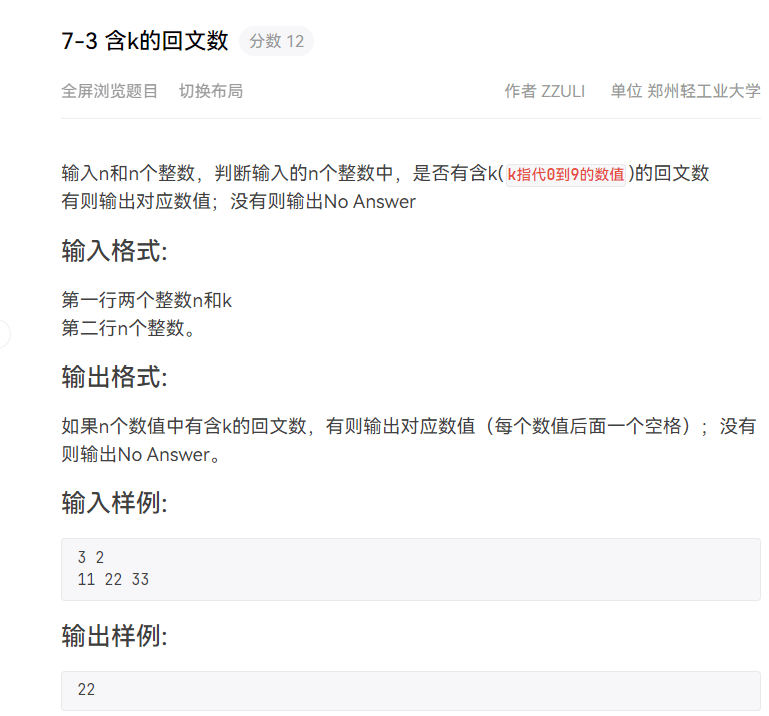

1. 题目：

    

    思路：

    ​	开始思路：通过在中途进行判断，即在这个回文数的中间判断其是否为回文数，这时有bug，无法确定其是否为到达中间，例如：由于判断是通过比较中间前后两个数是否相等，此时若其相等默认判断其可能为一个回文数，但是若此时为到达中间，在两边时满足这个条件，造成错误。

    ​	==正确思路==：紧扣定义，回文数是最前和最后两数相等，依次判断，若最终其到达中间，即此时其为回文数。

    ​	==改进==：一开始使用int整形来进行存储元素，但其太小，不易判断较大的数，通过改进为long long，此时虽然较为增大，但是仍可能溢出，因此可以选择string进行存储，并且其还可以使用下标和迭代器进行访问，进一步减少了元素拆解某一位的操作。

    源代码：

    ```c++
    #include<stdio.h>
    #include<vector>
    #include<math.h>
    #include<iostream>
    using namespace std;
    int huiwen(	long long  m,int k);
    int totest(vector<int>n,vector<	long long > num);
    int main()
    {
    	int n,k,m=0;
    	cin>>n>>k;
    	vector<	long long > arry(n);//相当于创建一个叫arry的数组，有n个元素 
    	
    	for(int i=0;i<n;i++)
    	{
    		long long ems; 
    		cin>>ems;
    		arry[i]=ems;
    	}
    	for(int em:arry)//相当于遍历这个数组 
    	{
    		if(huiwen(em,k))//调用函数，把这个数组输入的每个数进行检查是否满足回文数，返回1找到，0未找到 
    		{
    			cout<<em<<endl;
    			m++;//设置一个标志，看是否传入的数据中有回文数 
    		}
    	}
    	if(m==0)
    	{
    		cout<<"NO Answer\n"<<endl;
    	}
    	return 0;
    }
    int huiwen(	long long  m,int k) 
    {
    	int s=m,num=0;
    	vector<int> post;
    	vector<	long long > nums;
    	while(s)
    	{
    		
    		if(s%10==k)
    		{
    			post.push_back(num);//将该元素每一次出现过k的位置（nums中的位置）存入进一个数组 
    		}
    		nums.push_back(s%10);//将这个元素的每一位拆分进一个数组， 
    		num++;
    		s=s/10;	
    	}
    
    	if(post.size()<2)//这个出现k的次数小于2次即等于1或等于0，此时不可能有回文数 
    	{
    		return 0;
    	}
    	else 
    	{
    		if(totest(post,nums))//将这个拆分后的元素与出现的位置进行检查 
    		{
    			return 1;
    		}
    		else
    		{
    			return 0;
    		}
    	}
    }
    int totest(vector<int>n,vector<	long long > num)
    {
    	for(int i=0;i<n.size();i++)//由于回文数前后都是k，每一个位置与其他位置中间的元素进行检查，相当于冒泡排序，两次循环 
    	{
    		for(int j=i+1;j<n.size();j++)
    		{
    			int post1=n[i],post2=n[j];//真正开始检查，将前后两位置进行变量表示 
    	//退出循环的条件之一：如果最终其进行到中间，eg：234 2432342，其中如果3和3相等，即3和3的位置同时加一和减一，此时其相等 
    	//若中间没有2，即 234 243342，此时判断完3 和3相等后再进行加一和减一，此时前一个元素的位置大于后一个元素的位置，其差为-1，
    	//因此，进行循环的条件是 其差大于0 
    			while(post2-post1>0)
    			{
    				if(num[post1]==num[post2])//每次双方向中间靠拢，同时判断两边的元素是否相等 
    				{
    					post1++;
    					post2--;
    				}
    				else //如果前后两元素不相等，直接退出此循环，进行下两个位置的判断 
    				{
    					break;
    				}
    			}
    			if(post2-post1<1)//如果其差小于1即说明找到，差小于1和差大于0是互斥的！！！ 
    			{
    				return 1;
    			}
    
    		}
    	}
    	return 0;
    }
    ```

2. 