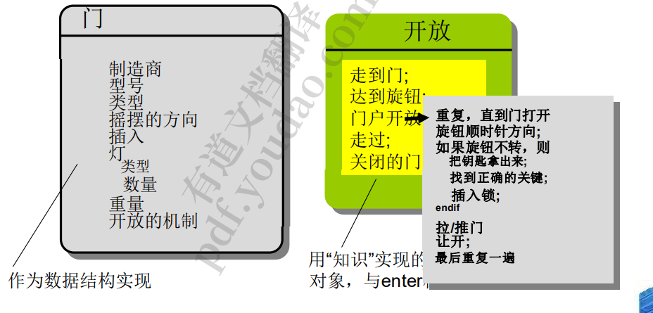

## 1.社会工程背景下设计

## 2.设计过程和设计质量

1. 优秀设计特点

   1. 设计必须实现分析模型中包含的所有显式需求，并且必须适应 客户所需的所有隐式需求。 
   2. 对于那些生成代码的人以及那些测试和随后支持软件的人来说， 设计必须是一个可读的、可理解的指南。 
   3.  设计应该提供软件的完整图景，从实现的角度处理数据、功能 和行为领域

2. 设计原则

   1. 设计过程不应该受到“隧道视野”的影响。 
   2. ➢ 设计应该可以溯源到分析模型。
   3.  ➢ 设计不应该重新发明轮子。
   4.  ➢ 设计应该“最小化软件和现实世界中存在的问题之间的智力距 离”[DAV95]。
   5.  ➢ 设计应该表现出统一性和集成度。
   6.  ➢ 设计的结构应该适应变化。
   7.  ➢ 设计的结构应该是温和地降级，即使遇到异常的数据、事件或操作 条件。
   8.  ➢ 设计不是编码，编码不是设计。
   9.  ➢ 设计的质量评估应该在设计过程中进行，而不是在设计完成之后。
   10.  ➢ 应该对设计进行审查，以最大限度地减少概念(语义)错误。

   ## 3.设计概念

   1. 基本概念
      1. 抽象——数据、过程、控制
         1. 
      2. 精细化——自上而下的设计策略
      
   2. • 体系结构(Architecture):软件的整体结构，以及该结 构为系统提供概念完整性的方式。(SHA95a) 
      1. ➢ 结构模型:将架构表示为程序组件的有组织的集合 
      2. ➢ 框架模型:通过尝试识别在类似类型的应用程序中遇到的可重复 的架构设计框架来增加抽象级别 
      3. ➢ 动态模型:处理程序体系结构的行为方面，表明结构或系统配置 如何随着外部事件的作用而改变
      4.  ➢ 流程模型:专注于系统必须适应的业务或技术流程的设计。 
      5. ➢ 功能模型:表示系统的功能层次结构
      
   3. 模式
      1. – 图案名称描述了图案的本质 
      2. – Intent描述了模式及其作用
      3.  – 也称为模式的同义词 
      4. – 动机提供了一个问题的例子
      5.  – 适用性模式适用的具体设计情况 
      6. – 实现模式所需的结构类 
      7. – 类的参与者职责 
      8. – 协作参与者如何协作来完成他们的职责 
      9. – 后果描述了影响模式和潜在权衡的“设计力量”
      10.  – 相关的模式交叉引用相关的设计模式
      
   4. 概念
      1. 模块化
         1. 
      
      2. 信息隐藏
         1. 
      
      3. 功能独立
         1. 耦合
            1. 
         2. 目标：尽可能松散=尽可能独立
         3. 耦合程度
            1. 内容耦合 :一个模块修改另一个模块。
               1. 
            2. 公共耦合:数据可以从一个公共的数据存储中访问。
      
         ## 3.创建架构设计
      
         
      
         1. 软件架构
            1. 概念：一个程序或计算系统的结构或结构，它由软 件组件、这些组件的外部可见属性以及它们之 间的关系组成。
            2. 意义：
               1. 软件体系结构的表示是对基于计算机的系统开发感兴趣的所有各方 (利益相关者)之间的沟通的推动者。 
               2. 体系结构突出了早期的设计决策，这些决策将对随后的所有软件工 程工作产生深远的影响，同样重要的是，对系统作为一个操作实体的 最终成功产生影响。 
               3. 架构“构成了一个相对较小的，智力上易于 gras 的模型，系统是如 何构造的，以及它的组件如何一起工作”
            3. 早期的大方向，全局观
         2. 数据设计
            1. 架构层面
               1. 设计一个或多个数据库来支持应用程序架构 
               2. 多个数据库内容挖掘方法的设计 
                  1. -浏览现有数据库，试图提取合适的业务级信息 
                  2. -数据仓库的设计-一个大型的、独立的数据库，可以访问 存储在数据库中的数据，这些数据库为企业所需的应用 程序集提供服务 
            2. 组件层面
               1. 细化数据对象并开发一套数据抽象 
               2. 将数据对象属性实现为一个或多个数据结构 
               3. 审查数据结构，以确保已经建立了适当的关系 
               4. 根据需要简化数据结构 请阅读 10.2.2 节中的原
         3. 建筑风格—不同功能可套用不同的设计风格
            1. 建筑风格  每种风格描述了一个系统类别，包括:
               1. (1)一组执行系统所 需功能的组件(例如，数据库，计算模块)
               2.  (2)一组连接器，使组件之间能够“通信、协调和合 作” 
               3. (3)定义如何将组件集成以形成系统的约束
               4. (4)语义模型，使设计人员能够通过分析系统组成部分的已知 属性来理解系统的整体属性。
            2. 数据中心架构
               1. 
            3. 数据流体系架构
               1. 
            4. 面向对象的体系架构
            5. 调用与返回架构—-最常见
               1. 上面做决策，下面做工作
               2. 宽度和深度要恰当，入度和出度（对于一个节点而言）
               3. 对于修改和合并不适合。保持低耦合
               4. 从下往上编写，从下往上测试
               5. 
            6. 分层体系架构
               1. 
               2. 
         4. 建筑模式
            1. 架构模式
               1. 并发——应用程序必须以模拟并行的方式处理多个任务
                  1.  -操作系统进程管理模式
                  2.  -任务调度器模式 
               2. persistence -如果数据在创建它的进程执行之后仍然存在，则数据 将持续存在——数据库
                  1.  -数据库管理系统模式 
                  2. -应用级持久性模式，将持久性特性构建到应用程序架构中
               3.  分布——在分布式环境中，系统或系统中的组件相互通信的方式 
                  1. -代理充当客户端组件之间的“中间人” 和服务端组件
         5. 建筑设计
            1. 在上下文中表示系统———将该系统放入大的外部环境中考虑
            2. 架构上下文图(ACD):对目标系统与其边界之外的实体交互的方式 进行建模。
               1.  上级系统——那些使用目标系统的系统 Em 作为一些更高层次处理方案的一部分 
               2. 下级系统-那些被目标系统使用并提供完成目标系统功能所需的数 据或处理的系统 
               3. 点对点系统——那些在点对点的 eer 基础上进行交互的系统。信息 由对等体和目标系统产生或消费) 
               4. 行动者——那些实体(人，设备)通过产生或消费必要的处理所需的 信息来与目标系统进行交互
            3. 建筑脉络图（ACD）
               1. 
               2. 
            4. 定义原型
               1. 代表对目标系统架构设计至关重要的核心抽象的类或模 式
            5. 评估代替建筑设计
               1. 一种架构权衡分析方法 
                  1. 步骤 1。收集场景。 
                  2. 步骤 2。引出需求、约束和环境描述。 
                  3. 步骤 3。描述曾经的建筑风格/模式 
               2. 为解决场景和需求而选择的。
               3. 第四。通过单独考虑每个属性来 评估质量属性: 
               4. 可靠性、性能、安全性、可维护性、灵活性、 可测试性、可移植性、可重用性和互操作性。
               5. 识别质量属性的敏感度各不相同 
               6. 特定建筑风格的建筑属性。第六段。评价候选架构 (在步骤 3 中开发) 
               7. 使用步骤 5 中进行的敏感性分析。
               8. 做了什么和为什么这样做
         6. 将数据流映射到软件架构中
            1. 其可相互嵌套调用
            2. 结构化设计—一种建筑方法，派生调用并返回架构
               1. 
            3. 变换流  I-P-O
               1. 
            4. 事务流
               1. 
            5. 变换映射
               1. 
            6. 事务映射—类似树
               1. 
         7. 分区程序架构
            1. 水平分区
               1. 为每个主要功能定义模块层次结构的单独分支 -
               2. 使用控制模块来协调功能之间的通信
               3. 
            2. 垂直分区
               1. -设计使决策和工作分层——决策模块应该位于顶部 该体系结构
               2. 
               3. 
               4. 
      
         