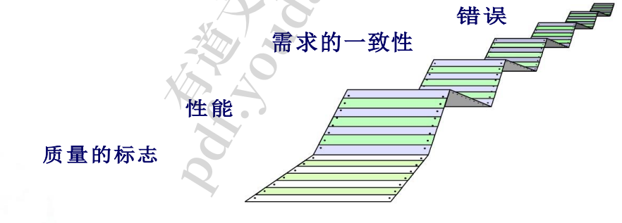
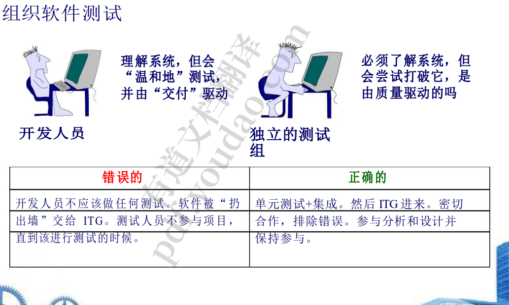
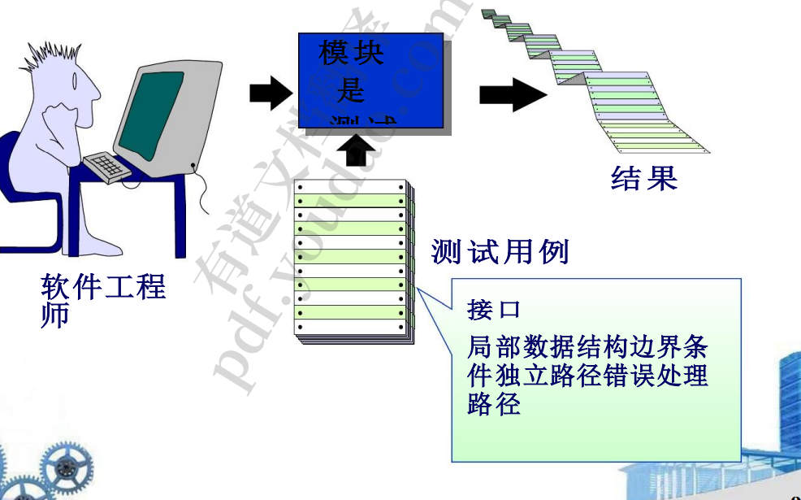
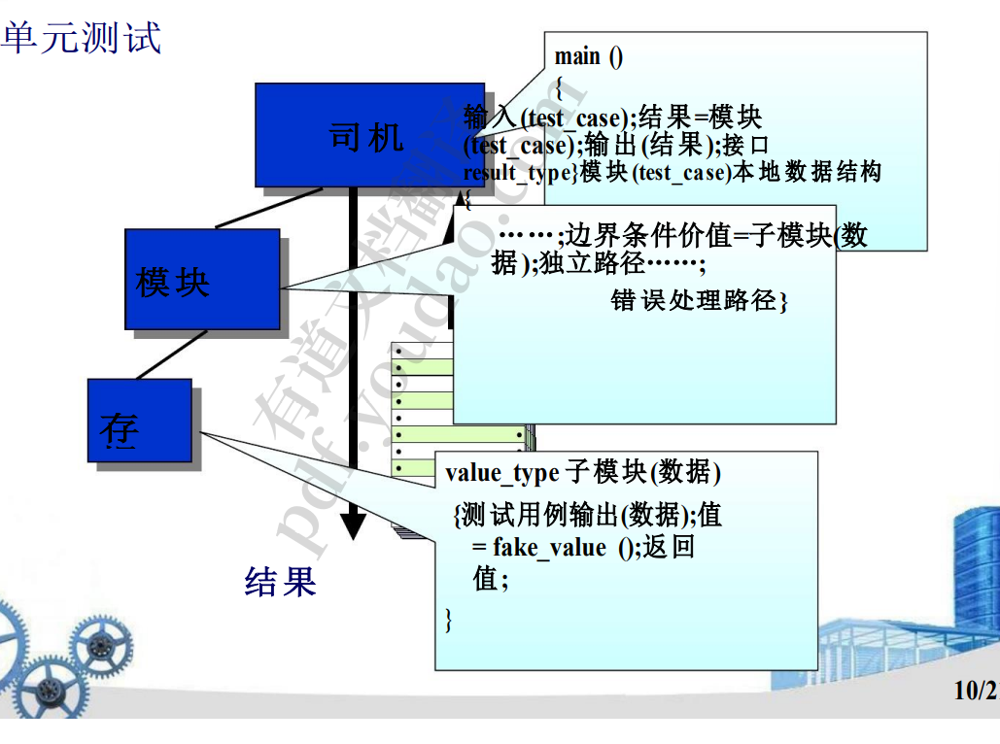
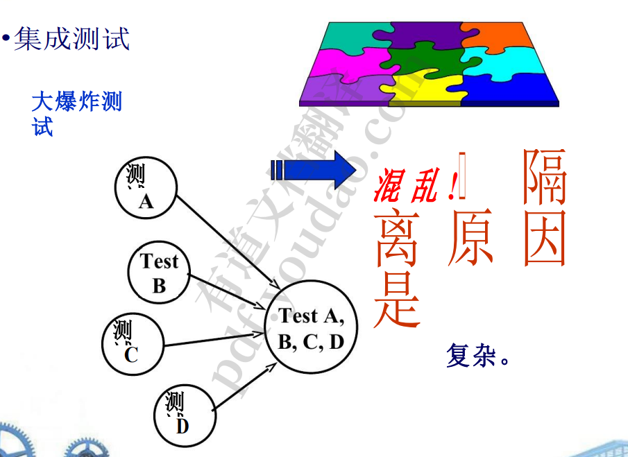
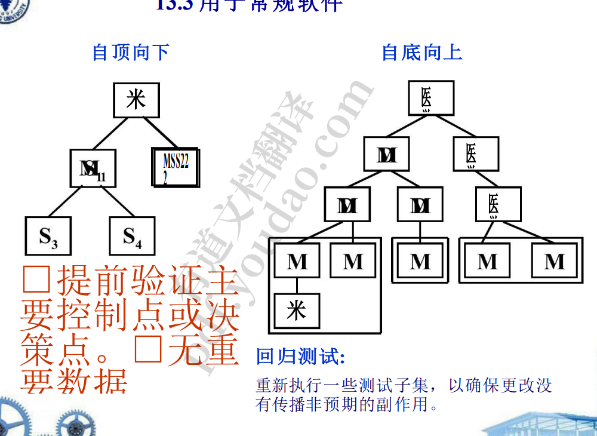
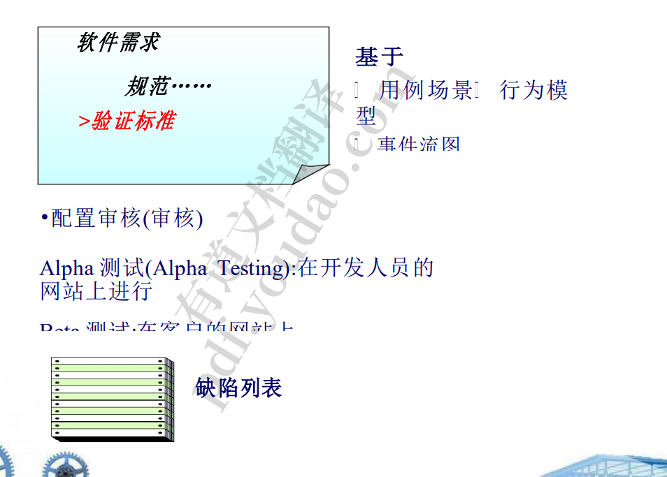
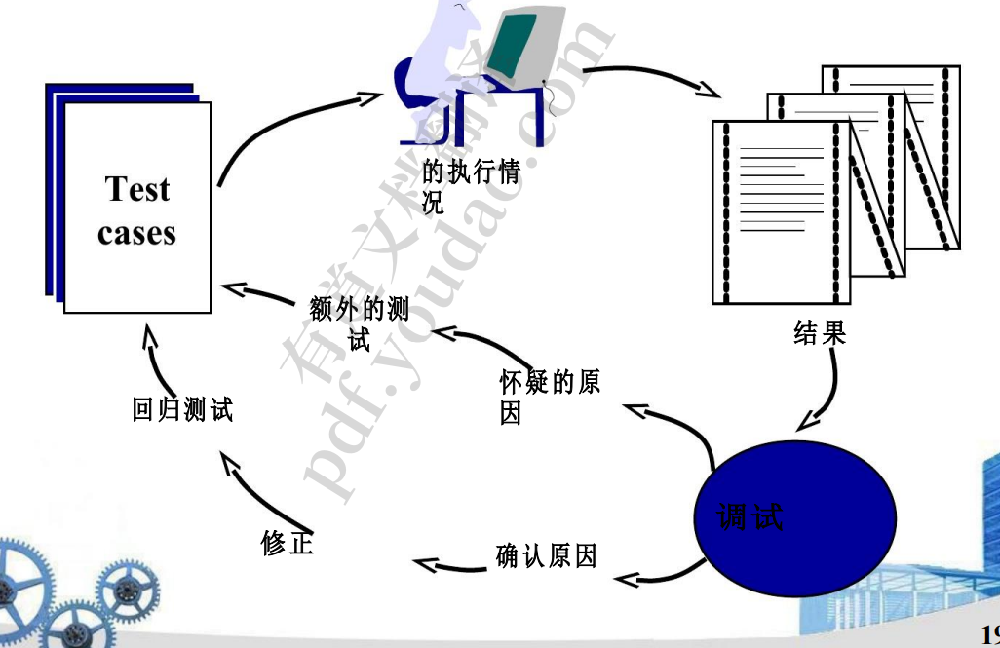
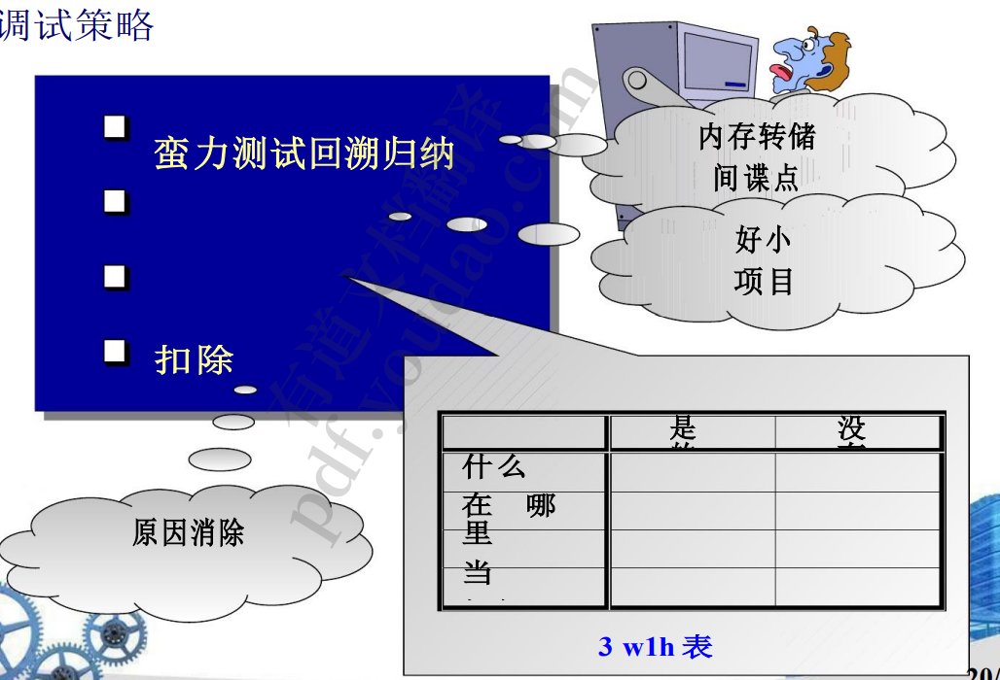

1. 软件测试的策略方法
   1. 测试的目的是什么? 
      1. 测试是运行程序的过程，目的是在交付给最终用户之前找出错误。 
      1. 软件测试一般是在设计阶段，代码还没编写前就可以考虑
   2. 测试显示了什么?
      1. 
   3. 测试从组件开始，向外扩展，直至整个基于计算机的 系统的集成。 
   4. 在不同的时间点使用不同的测试技术。
   5.  软件开发人员进行测试，并可能由独立的测试小组协 助大型项目。 
   6. 测试和调试是不同的活动，但调试必须包含在任何 测试策略中
2. 验证和确认  SQA（每个功能是否正确，成为一个整体是否正确）
   1. 构建的产品是否正确，
   2. 做的产品是否对
   3. 软件测试只是 SQA 的一个组成部分。 
   4. 质量必须建立在开发过程中，不能在事后用测试来 增加质量。
   5. 组织软件测试
      1. 
   6. 用于传统的软件架构
      1. 单元测试——大量使用测试技术，锻炼特定的控制路径，以单独 检测每个软件组件中的错误。 
      2. 集成测试——当组件开始彼此交互时，关注与验证和程序构造相关 的问题。
      3.  验证测试——保证软件验证标准(在需求分析期间建立)满足所有功 能、行为和性能需求。 
      4. 系统测试——验证所有系统元素正确地结合在一起，并且实现了整 体系统功能和性能。
   7. 面向对象的体系架构—–测试较为麻烦
      1. 单元测试——大量使用测试技术，锻炼特定的控制路径，以单独 检测每个软件组件中的错误。 
      2. 集成测试——当组件开始彼此交互时，关注与验证和程序构造相关 的问题。
      3. 验证测试——保证软件验证标准(在需求分析期间建立)满足所有功 能、行为和性能需求。 
      4. 系统测试——验证所有系统元素正确地结合在一起，并且实现了整 体系统功能和性能。
      5. class和class之间交流的测试较为麻烦
   8. 测试只是找到错误，不能全部找出错误，有些错误可能不影响，可以忍受
      1. 
3. 战略问题
   1. 在测试开始前，以可量化的方式指定产品要求。
   2.  明确指定测试目标。
   3.  确定软件用户的类别，并为每个用户建立个人资料。 模拟用户习惯
   4. 制定一个强调快速循环测试的测试计划。
   5.  构建能够自我测试的健壮的软件。 
   6. 在测试前使用有效的正式评审作为筛选器。
   7.  进行正式的技术评审以评估测试策略和测试用例。 
   8. 为测试过程制定持续改进的方法。 
4. 用于常规软件测试
   1. 单元测试
      1. 
      2. 
      3. 对一个模块调用的所有小模块分别进行测试，若其均无错，再看整体结果，若结果错了其他没错，则是大模块错了
   2. 集成测试
      1. 
      1. 添加到一起测试，不好，不容易测试，特别麻烦。不知道是谁的错
   3. 自顶向下
   4. 自底向上
   5. 
      1. top-down先看大方向，对于底层问题正确与否较晚测试
      2. 回归测试，当修改一个bug后，不仅要测该问题，还要与这个bug可能导致的问题测试
   6. 冒烟测试
      1. 在一个测过正确的模块集合中，将待测模块加入，若加入后有问题，则是新加入模块有问题，否则无问题
   7. 通用测试标准
      1. 接口完整性-内部和外部模块接口在每个模块或集群添 加到软件时进行测试
      2.  功能有效性-测试以发现软件中的功能缺陷 
      3. 信息内容——测试局部或全局数据结构中的错误 
      4. 性能-测试指定的性能边界
5. 用于面向对象软件
   1. 测试：
      1. 线索测试：输入数据，到输出结果，跟踪其过程，看是否出现问题
      2. down -top测试：先测最基本最简单的类，再依次测试调用简单类的类，依次复杂

   2. 单元测试=类测试 
      1. 绝对不能单独测试操作(层次结构) 由类操作和状 态行为驱动，不能 
      2. 算法细节和数据跨模块接口流动 
   3. •集成测试 基于线程的测试——测试所有需要响应一个系统输入或事件 的类  
      1. 基于使用的测试——首先测试独立类(使用很少服务器类 的类)，然后测试使用它们的依赖类 
      2. 集群测试——对协作类的组进行交互错误测试
   4. 
   5. 系统测试
      1. •恢复测试—强制软件失效 ，破坏性测试
      2. •安全测试——验证系统保护机制防止不当渗透或数 据篡改 
      3. •压力测试——检查程序，看它如何处理异常的资源 需求(即、数量、频率或体积)----在它失败之前，我们可以把它 调到多高? 
      4. •性能测试——旨在测试软件的运行时性能，特 别是实时软件
   6. 调试的艺术
      1. 调试过程
      2. 
      3. 调试策略
         1. 
         2. 

