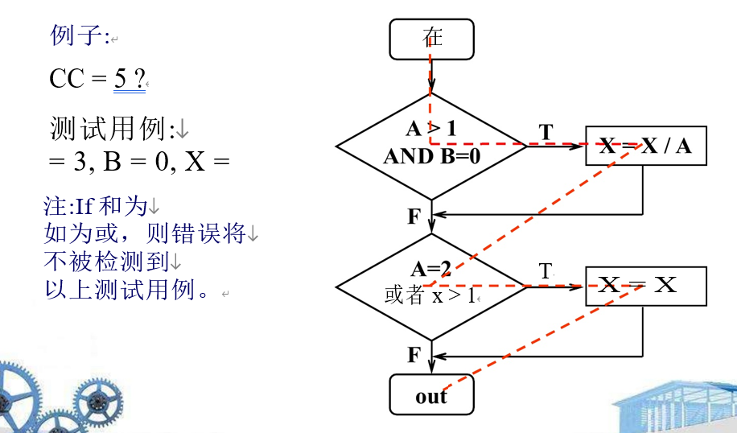
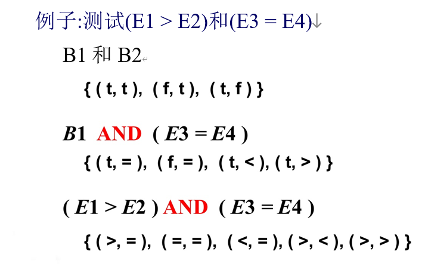
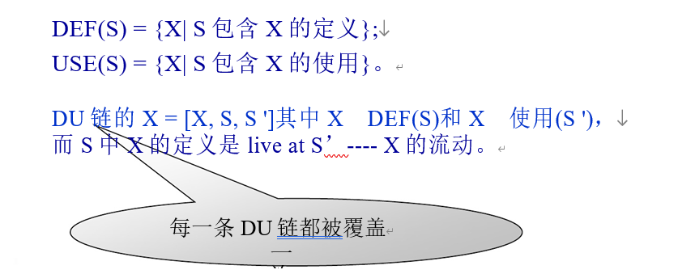
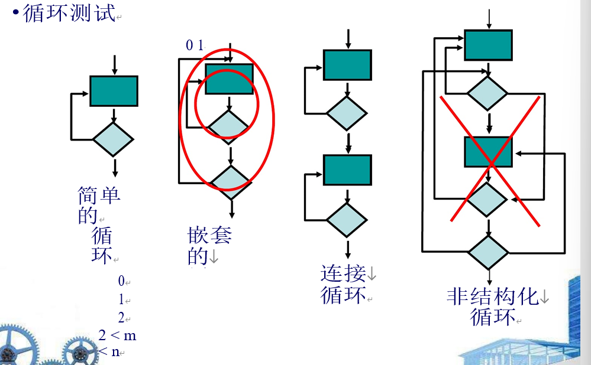
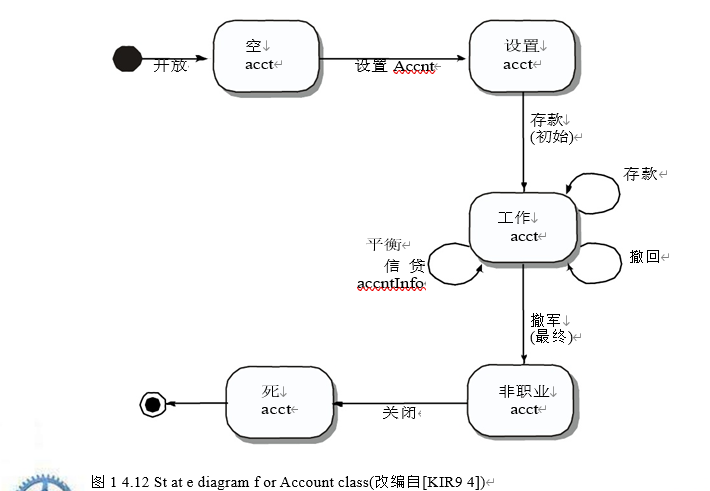

1. 测试基础

   1. 好的测试	
      1. 一个好的测试有很高的概率发现错误
      2. 好的测试是不冗余的
      3. 好的测试应该是“品种中的佼佼者”，有代表性
      4. 一个好的测试既不能太简单，也不能太复杂，
         1. 太小：一个测试对应一个问题，若该测试错了则这个问题错了
         2. 一个测试点一个cover比较多的点，但是不应该太多
   2. 测试用例设计
      1. 目标:发现错误
      2. 标准:完整
      3. 约束:用最少的精力和时间，
      4. 大多数情况下完备测试时比较难的
   3. 可测试性
      1. 可操作性——它工作得越好，测试效率就越高
      2. 可观察性——所见即所测—–黑白盒
      3. 可控性——越好的软件越能被控制
          测试可以自动化和优化
      4. 可分解性——通过控制测试的范围，越多
          快速地将问题隔离出来，智能地重新测试
      5.  简单性——可测试的东西越少，我们测试的速度就越快
      6. 稳定性——变化越少，中断越少
          测试
      7. 可理解性——知道的信息越多，越聪明
          测试

2. 黑盒白盒测试

   1. 为什么不详细测试：

      1. 用例太多，耗时长

   2. 测试不能显示确实错误和缺陷

   3. 就算测试全部通过也不能保证该系统无问题

   4. 白盒测试
   
      1. 定义：
      2. 白盒测试或玻璃盒测试
         1. 了解产品的内部工作原理，进行测试
         2. 检查所有可能的逻辑路径的工作方式——在小范围内进行测试。
         3. 关键路径测试
      3. 问题：
         1. 你能保证一个模块内的所有独立路径，一个路径不能被其他路径组合起来实现
             会被执行至少一次?
         2. 你能根据他们的真假来锻炼所有的逻辑决策吗
             分支机构?
         3. 所有的循环都会在它们的边界和内部执行业务范围?
         4. 能否通过锻炼内部数据结构来保证其有效性?
      4. 目标:每条语句至少执行一次
         1. 路径覆盖 较强
         2. 节点覆盖 较弱
   
   5. 基路径测试
   
      1. 准备测试用例，强制执行每条路径在基础集合中的路径-只执行每条语句至少执行一次是不够的
      2. 
   
   6. 控制结构测试
   
      1. 条件测试:每个条件至少测试一次
         1. eg：
      2. 数据流测试：根据程序中变量定义和使用的位置
         1. 
      3. 循环测试
         1. 
      4. 黑盒测试：
         1. 定义：黑盒测试或行为测试
            1. 了解产品要执行的特定功能，仅根据其规格说明演示正确的操作， 而不考虑其内在逻辑——在大范围内进行测试
         2. 问题：
            1. 如何测试功能有效性?
            2. 如何测试系统行为和性能?
            3.  哪些类别的输入将成为好的测试例?
            4.  系统是否对某些输入值特别敏感? 比如奔溃啥的
            5.  数据类的边界是如何隔离的?
            6.  系统能容忍的数据速率和数据量是多少? 压力测试
            7.  数据的特定组合会对系统产生什么影响操作?
         3. 技术：
            1. 基于测试
            2. 等价划分
               1. 等价类表示一个有效或无效的集合状态为输入条件，因此没有特别的原因选择一个元素而不是另一个元素作为类代表。
               2. 指导：
                  1. 如果输入条件指定了一个范围，一个有效，两个有效
                      无效的等价类被定义。
                  2. 如果一个输入条件需要一个特定的值，一个有效 并且定义了两个无效的等价类。
                  3. 如果一个输入条件指定了集合中的一个成员，则其中一个有效
                      而定义了一个无效的等价类。
                  4. 如果一个输入条件是布尔值，一个有效一个无效
               
            3.  边界值分析
               1. 虫子潜伏在角落里
               2. 如果inputandconditioncongregate指定一个以值a为边界的范围
                   B，测试用例应该和边界…”包括a和B，值就在上面
                   就在a和b下面。
               3. 如果输入条件化器和数值，测试Boris指定例应行使最小值和最大值 数字，以及正上方和正下方的值最小值和最大值。
               4. 将准则1和2应用于输出条件，测试用例
               5.  应该设计成生产最小值和最大值吗
                   输出报告。
               6. 如果程序内部数据结构有边界(例如: 大小限制)，一定要测试边界。边边角角最容易出错
            4. 正交数组测试
               1. 每个测试用例都应该被==唯一地标识==并且应该是明确的
                   与要测试的==类==相关联，
               2. 应说明测试的目的，
               3. 应该为每个测试制定一个测试步骤的列表
               4. 包含(BER94):
                  1. 被测试对象的指定状态列表
                  2. 将被执行的消息和操作的列表测试的结果
                  3. 测试对象时可能发生的异常列表
                  4. 外部条件列表
                  5. 有助于理解或理解的补充信息实施测试。
               5. 不像传统的测试用例设计，由I-P-O驱动软件视图或单个模块的算法细节，面向对象测试的重点是设计适当的操作序列类的状态。
      5. 面向对象的测试方法
         1. •结合测试
            1. 测试人员寻找合理的错误(例如:的方面
                可能导致系统缺陷的实施方面)。来
                确定这些故障是否存在，设计测试用例
                来练习设计或编码。
         2. 类测试和类层次测试
            1. -继承不排除彻底测试的需要 所有派生类。事实上，它实际上可以使
                测试过程
            2. 子类和父类均需要测试，
         3. 基于场景的测试设计
            1. 基于场景的测试专注于用户做什么，而不是产品做了什么。这意味着捕捉任务 (通过用例)用户必须执行的任务，然后应用它们和它们的变体作为测试。
            1. 不关注系统具体实现，而关注用户使用场景
         4. 随机测试
            1. 识别适用于某个类的操作
            2. -定义使用它们的约束
            3. -确定最小测试序列
            4. 定义最小寿命历史的操作序列 类(对象)的
            5. -生成各种随机(但有效)测试序列
            6. •练习其他(更复杂的)类实例生命历史
            7.  需要大量的数据排列和组合，可能会效率低下。
         5. 分区测试
            1. 减少测试类所需的测试用例数量与常规的等价类划分方法相同软件
            2. 基于状态的分区
               1. •根据操作的能力进行分类和测试改变类的状态
            3. ——属性的划分
               1. 根据属性对操作进行分类和测试 他们使用
            4. ——category-based分区
               1. •基于泛型函数对操作进行分类和测试每一个执行
      6. 类间测试用例设计
         1. 多类测试（随机）
            1. -对于每个客户端类，使用类操作符列表来生成 一系列随机测试序列。操作员将发送消息发送给其他服务器类。
            2. -对于生成的每条消息，确Collaborator类和服务器中相应的操作符 对象。
            3. -对于服务器对象中的每个操作符(已被调用的)从客户端对象发送的消息)，确定消息它传递
            4. -对于每条消息，确定下一级的
                被调用的操作符，并将它们合并到测试中序列。
         2. 行为测试
            1. 要设计的测试应该实现所有状态的覆盖
               1. 
         3. 专业测试
            1.  图形用户界面
               1.  •客户端/服务器架构
               2. •文档和帮助设施
               3. •实时系统
         4. 测试模式
            1. 定义并复用
            1. 在测试过程中若找到规律，可将规律抽象出，自行设计一个模式

   7. 测试永远不会结束，它只是被转移从你(软件工程师)到你的客户。每次你的客户使用程序，就会进行一项测试。
   
   8. 用最少的case完整的测试系统
   
      
   
   