## WEb项目管理

1. 初始化WebApp项目
   1. 制定
      1. 首先要确定业务需求 •
      2.  然后进入WebApp目标的描述 • 定义主要特性和功能 •
      3.  建立一个需求收集活动，该活动将导致分析模型的开 发
      4. • 允许涉众和web工程团队为构建web应用程序建立一 套共同的目标和目标。
   2. 问题：
      1. ➢ WebApp的主要动机(业务需求)是什么?
      2. ➢ WebApp必须实现的目标是什么? 
      3. ➢ 谁会使用WebApp? 
         1. 用户群体（受教育程度，性别，年龄）
         2. 可做调查问卷，对用户群体进行了解
      4. 答案提供… 
         1. ✓ 信息目标——表明为最终用户提供特定内容和/或信息的意图 
            1. 数据
         2. ✓ 适用性目标——表明在网络应用中执行某些任务的能力
            1. 功能
   3. 需求收集
      1. ➢ 要求利益干系人定义用户类别，并为每个类别开发描述 
         1. ✓ 客观、背景、到达、喜欢/不喜欢…… 
      2. ➢ 与利益相关者沟通，定义基本的WebApp需求
         1.  ✓ 传统焦点小组、电子焦点小组、迭代调查、探索性调查、 场景构建 
      3. ➢ 分析收集到的信息，并利用信息与利益相关者进行后续沟通 
         1. ✓ 内容对象、操作、功能…… 
      4. ➢ 定义用例，描述每个用户类的交互场
   4. 项目计划
      1. 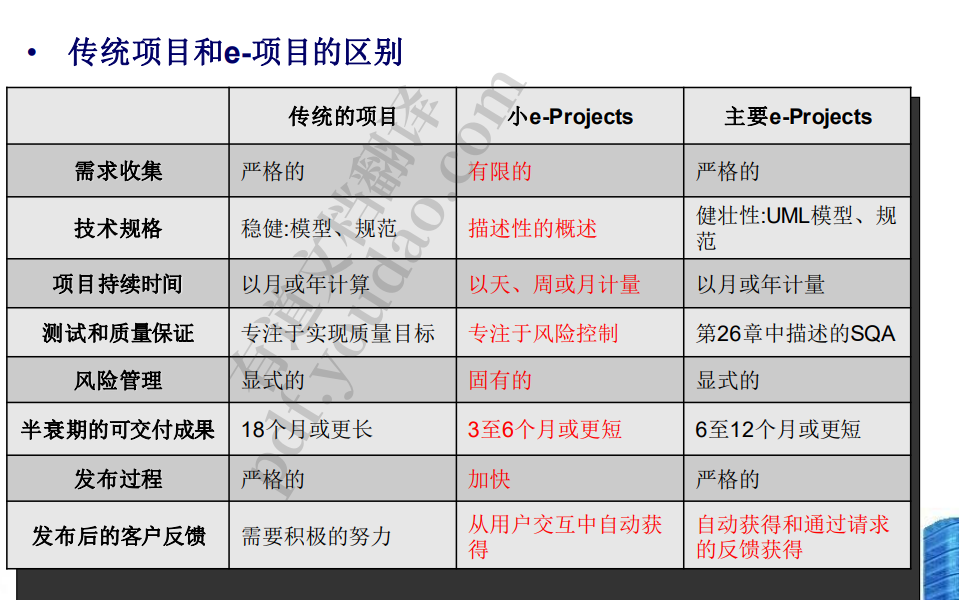
      1. 强调风险控制和快速，时间和质量的平衡
   5. WebE团队角色 
      1. – 内容开发人员 /供应商 
      2. 网络出版商
      3. – 网络工程师 
      4. – 业务领域专家
         1. 政策规则最清楚的人 
      5. – 支持专家 
      6. – 管理员(又名“网络管理员”)
   6. 项目管理问题
      1. 外包与内包
         1. 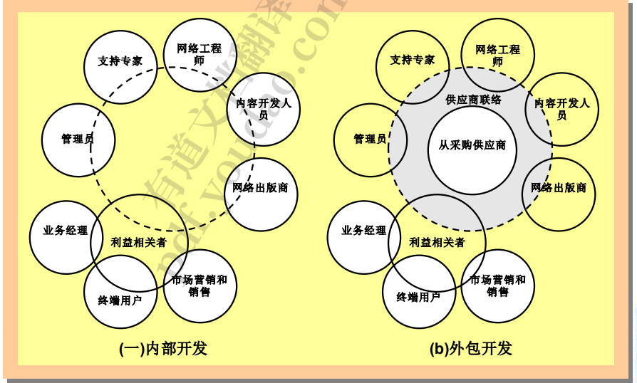
      2. 外包：
         1. 通过执行以下内部任务来启动项目 
            1. – 收集需求 
               1. 需求双方明确理解，
            2. – 开发一个粗略的设计 
            3. – 制定一个包含交货日期的粗略时间表 •
               1.  考虑增加 –
            4. 列出责任清单 
               1. • 为内部员工
               2.  • 外包供应商 –
            5. 需要双方联络员
         2. 选择候选外包供应商 ➢
         3. 评估报价的有效性和评估的可靠性 –
            1.  WebApp的报价成本是否提供了直接或间接的投资回报， 以证明项目的合理性? 
            2. – 提供报价的供应商是否展示了我们所需要的专业和经验? 
         4. ➢ 了解你可以期望/执行的项目管理程度 
            1. 交给他之后对该项目的管控程度，比如具体进度，大致进度可以管理
         5. ➢ 评估开发进度 
         6. ➢ 管理范围
      3. 内包
         1. ➢ 了解范围、变化的维度和项目约束 
         2. ➢ 定义一个增量项目策略 
         3. ➢ 执行风险分析(进度，技术) 
         4. ➢ 建立一个快速的评估(宏观的，而不是微观的) ➢ 选择一个任务集(过程描述) 
         5. ➢ 建立一个时间表(任务时间轴上的增量)
         6.  ➢ 定义项目跟踪机制(计数用例) 
         7. ➢ 建立变更管理方法
   7.  WebE“最糟糕的做法”
      1. 我们有了一个好主意，那么让我们现在开始构建WebApp吧。 (基金?用户?) •
      2. 东西会不断变化，所以尝试了解WebApp的需求没有意义。 (更多不必要的变化?) • 
      3. 主导经验一直在传统软件开发的开发人员可以立即开发web应 用程序。不需要新的培训。(但它们是不同的) • 
         1. 不同领域的开发人员跨领域开发易出错
      4. 官僚主义。(鼓励之后就让开) 
      5. • 测试?何苦呢?(用户离开，再也不回来了
2. 

## web应用分析

1. web应用的需求分析
   1. 主要任务
      1. – 配方 
      2. – 需求收集 
      3. – 分析建模
   2.  制定:目标和目标+用户类别
      1. 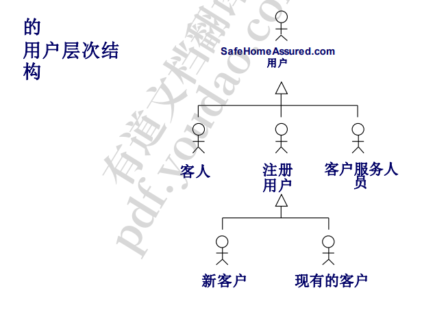
         1. 用户群体进行区分
   3. • 用例:针对每个用户类别(非正式)
      1. 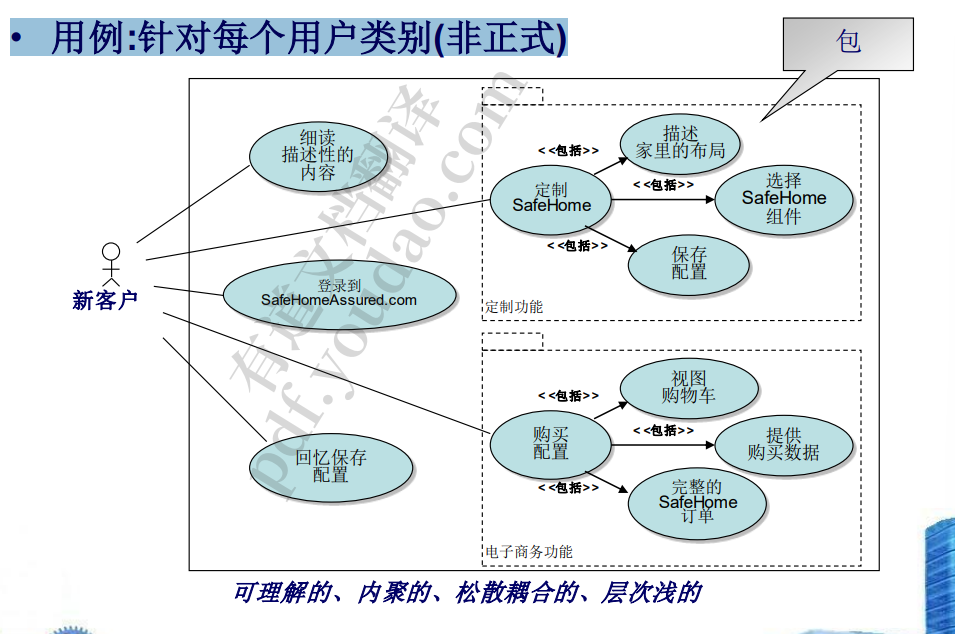
         1. 一个包之间的模块可以有紧密联系，但是包与包之间不要有太多联系
         2. 不要有太深的层次，太深的层次意味着太长的操作步骤，并且测试时非常麻烦
2.  web应用程序的分析模型
   1. 内容分析。识别WebApp将提供的全部内容，包括文本、图形 和图像、视频和音频数据。数据建模可以用来识别和描述每一 个数据对象。 
   2. • 相互作用分析。详细描述了用户与WebApp交互的方式。可以 开发用例来提供这种交互的详细描述。
   3. • 功能分析。作为交互分析的一部分创建的使用场景(用例)定义 了将应用于WebApp内容的操作，并暗示了其他处理功能。所 有的操作和功能都被详细描述。
   4. • 配置分析。详细描述了WebApp所在的环境和基础设施。
      1. 浏览器、操作系统、用户都不确定，不像专门为公司设置的项目
3. 内容模型
   1. 内容对象 :从用例中提取 
   2. • 内容关系和层次结构:ERD 或数据树
      1. 数据之间的关系
   3. 分析类：每个用例语法解析
      1. 使用词法分析器，自动化处理
      2. 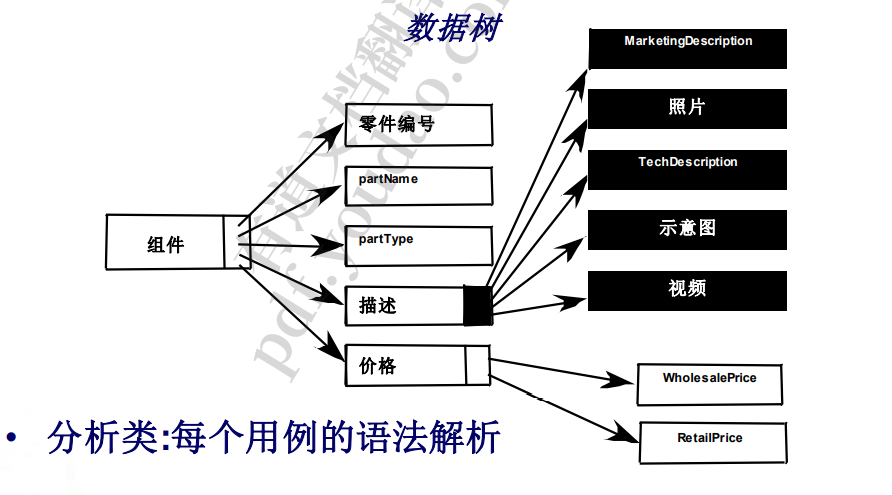
4. 交互模式
   1. 由 4个元素组成 :
      1.  – 用例 
      2. – 序列图 
      3. – 状态图 
      4. – 用户界面原型
   2. WebApp的处理元素 
      1. – 由网络应用程序交付给终端用户的用户可观察功 能 
      2. – 包含在分析类中的操作，实现与类相关的行为 
   3. • 工具:活动图
5. 配置模型
   1. 服务器端 
   2. – 服务器硬件和操作系统环境 
      1. – 互操作性的考虑 
      2. – 适当的接口、通信协议和相关的协作信息
   3.  • 客户端 
      1. – 浏览器配置问题 
      2. – 测试需求
6. 关系导航分析
   1. 利益相关者分析——识别各种用户类别，并建立适当的利 益相关者层次结构
   2. 元素分析——确定最终用户感兴趣的内容对象和功能元素 
   3. 关系分析——描述存在于WebApp元素之间的关系
   4. 导航分析——检查用户可能如何访问单个元素或元素组 
   5. 评估分析——考虑与实现之前定义的关系相关的实用问题 (例如，成本/效益)
      1. 考虑要做哪些事情和做到什么程度

## Web应用软件设计

1. Web工程的设计问题
   1. 设计和网络应用的质量 
      1. – 安全 
         1. ➢断然拒绝外部攻击 
         2. ➢不包括未经授权的访问
         3.  ➢确保用户/客户的隐私 
      2. – 可用性 
         1. ➢衡量一个网络应用可使用的时间百分比
      3. – 承压较高 
         1. ➢网络应用程序和与之交互的系统能处理用户或交易量的显 著变化吗 
      4. – 上市时间
   2. 设计目标 
      1. – 简单
      2. – 一致性:内容、美学、建筑设计、界面设计、导航 机制 
      3. – 身份:领域形象 
      4. – 鲁棒性
         1. 更新迭代快
      5. – 可导航性:在没有帮助的情况下四处移动 
         1. 易用性，对于特定软件来说，其群体固定，可培养，但是对于大众化软件，其用户群不可控，要考虑照顾到那些类型的客户
      6. – 视觉吸引力
      7. – 兼容性:硬件、互联网连接类型、操作系统、浏览 器…
      8. 可参考同类型网站设计
2. WebE设计金字塔
   1. 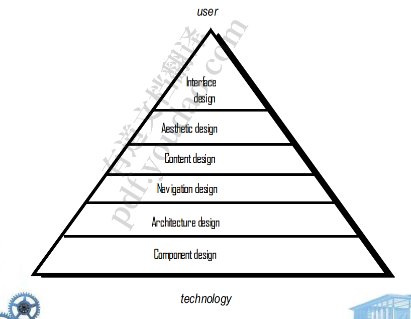
3.  WebApp界面设计
   1. 主要的问题 
      1. 我在哪儿? 
         1. ➢ 提供已访问过的网页应用程序的提示 
         2. ➢ 告知用户她在内容层次中的位置 
      2.  我现在能做什么? 
         1. ➢ 有哪些功能? 
         2. ➢ 哪些链接是直播的 ?
         3.  ➢ 哪些内容是相关的 ? 
      3. 我去过哪里，要去哪里?
         1.  ➢ 提供一个地图 
   2. 基本特征
      1. 有效的界面在视觉上是明显的和宽容的，灌输给用户一种 控制感。用户迅速看到他们选择的广度，掌握如何实现他 们的目标，并做好他们的工作。
         1. 一个东西给人的第一感觉就是他的功能
         2. 把用户当做白痴
      2. . 有效的界面不会让用户关注系统内部的工作方式。工作被被 仔细和持续地保存，为用户提供了在任何时间撤销任何活 动的完全选项。
         1. 可撤销
         2. 不想被用户破快的东西应该隐藏起来
      3. 有效的应用程序和服务执行最多的工作，同时需要用户提 供最少的信息。 
         1. 用户完成一个目标所做动作尽可能少
   3. 接口控制机制
      1. 导航菜单
      2. 图形图标
      3. 图形图像
      4. 布局排版
   4. 工作流
      1. 审查分析模型中包含的信息，并根据需要进行改进。 
      2. 开发WebApp界面布局的粗略草图。
      3.  将用户目标映射到具体的界面操作中。 
      4. 定义一组与每个操作相关联的用户任务。 
      5.  每个界面动作的故事板屏幕图像。 
      6. 使用美学设计的输入来完善界面布局和故事板。
      7. 识别实现接口所需的用户接口对象。
      8. 开发一个用户与界面交互的过程表示。
      9. 开发界面的行为表示。 
      10. 描述每个状态的界面布局。
      11.  完善和审查界面设计模型。
4. 美学设计
   1. 不要害怕留白。 
   2. •不要喧宾夺主
   3. • 大多数人阅读习惯是从左上角到右下角组织布局元素。
   4.  • 对页面内的导航、内容和功能进行地理分组。 相同功能的东西尽可能放到同一个块位置
   5. • 不要用滚动条扩展你的空间。最重要的位置尽可能放到上面，尽量一个界面
   6.  • 设计布局时考虑分辨率和浏览器窗口大小
5. 内容设计
   1. 设计问题
      1. 开发内容对象的设计表示
      2.  – 表示将它们之间的关系实例化所需的机制
      3. UNL
6. 建筑对象
   1. 内容架构关注的是内容对象(或复合对象，如网页)的 结构方式，用于表示和导航。
      1. 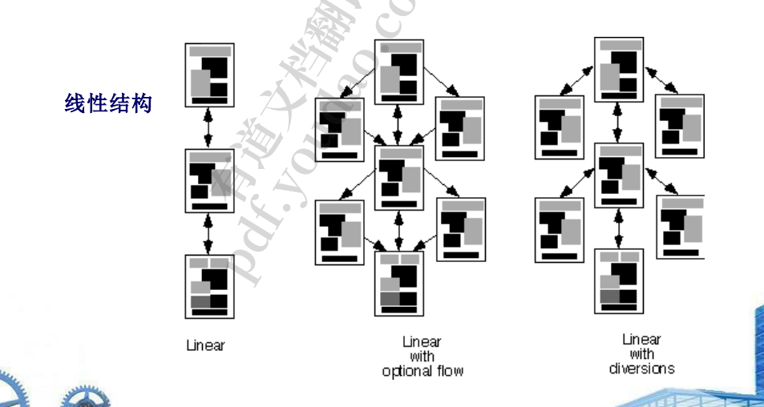
      2. 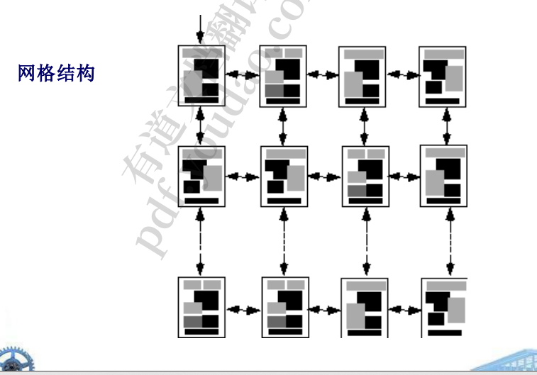
      3. 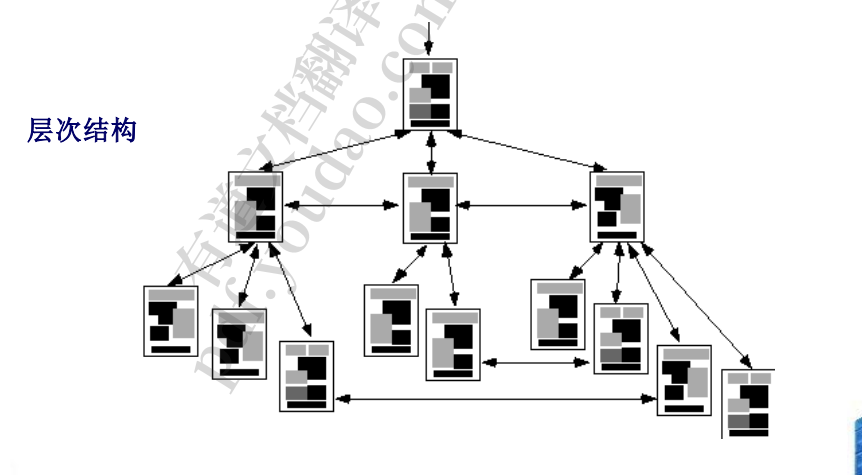
      4. 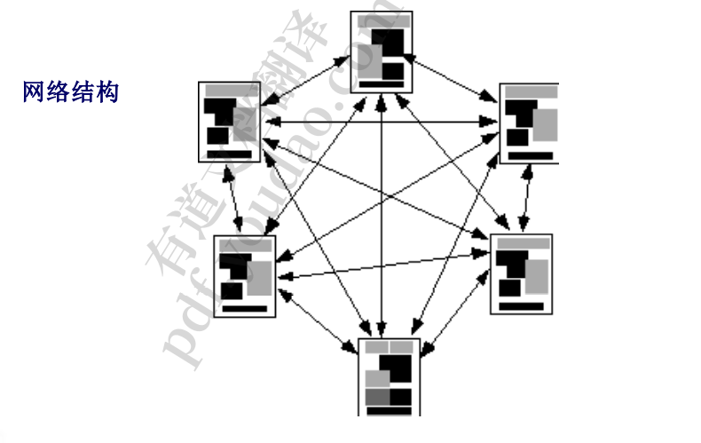
   2. WebApp架构描述了一种使基于web的系统实现其 业务目标的基础设施。 
   3. • 模型-视图-控制器(MVC)架构 
      1. 后台前台和控制，前台接受数据，控制模块将前台收到的数据发送给后端处理
      2. – 模型包含所有应用程序特定的内容和处理逻辑 
      3. – 视图包含所有接口特定的功能
      4. – 控制器管理对模型和视图的访问，并协调它们之间的数据 流
7. 导航设计
   1. 导航语义单元(NSU) 
      1. – 一组信息和相关导航结构，协同完成相关用户需 求的子集
      2. – 为与每个用户角色相关联的每个用例提供一个 NSU
      3. 通过链接来控制每个界面
   2. 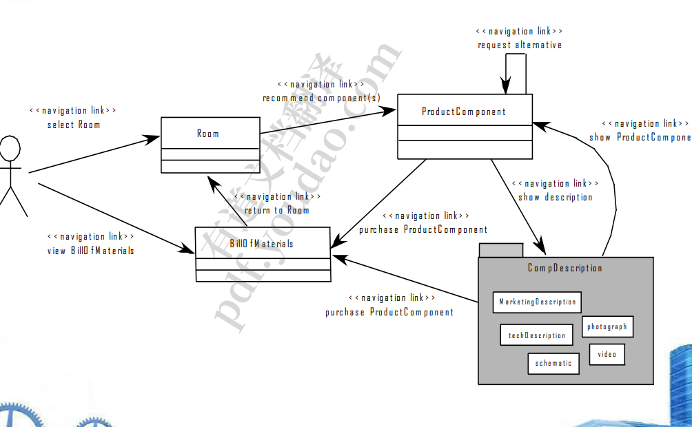
   3. 语法 
      1. – 独立导航链接——基于文本的链接、图标、按钮和开关， 以及图形隐喻… 
      2. – 水平导航栏-在包含适当链接的栏中列出主要内容或功能类 别。一般列出4到7个类别。
      3. – 垂直导航栏 
         1. 垂直的类别不加要求，因为有滚轮，内容可以上下滚动
         2. • 列出主要内容或功能类别 
         3. • 列出几乎所有WebApp中的主要内容对象。
      4. – 选项卡-无非是导航栏或列的一个变化，表示内容或功能类 别的选项卡表，当需要链接时被选择。
      5. – 站点地图-提供一个包含所有内容的标签页，用于导航到 WebApp中包含的所有内容对象和功能。
8. 级设计
   1. WebApp组件实现了以下功能 
      1. – 执行本地化处理，以动态方式生成内容和导航能 力 –
      2.  提供适合WebApp业务领域的计算或数据处理能 力 –
      3.  提供复杂的数据库查询和访问功能 
      4. – 与外部公司系统建立数据接口
