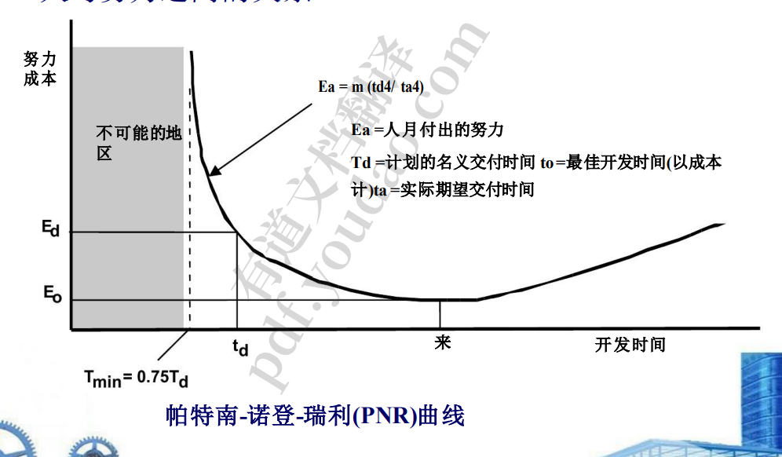
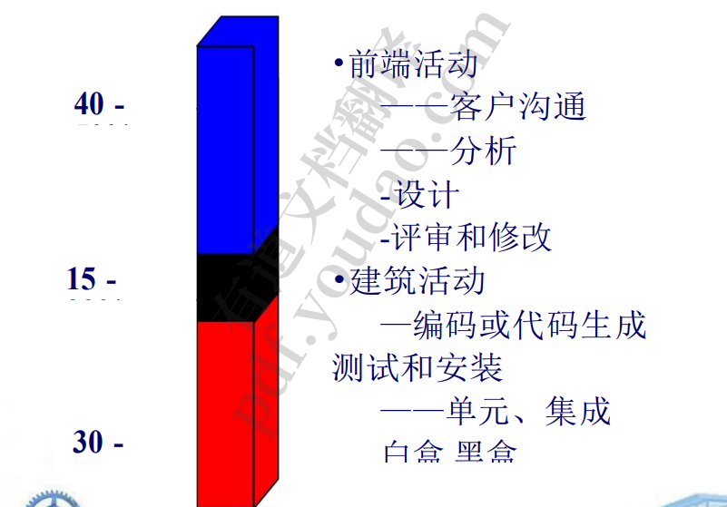
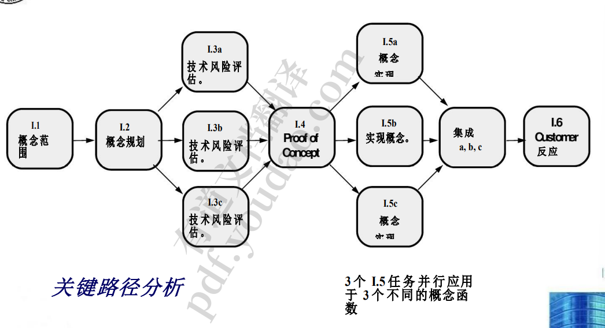
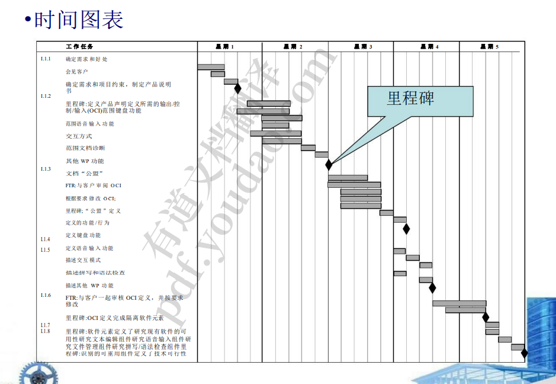
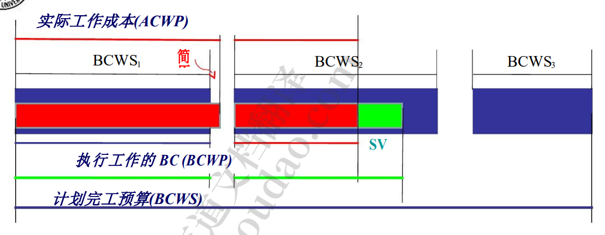

1. 进度
   1. 为什么要延期? 
      1. -软件开发团队以外的人设定的不切实际的截止日期 客户需求的变化没有反映在进度变化中 
      2. -诚实地低估完成这项工作所需的工作量和/或资源的数量
      3.  -项目开始时没有考虑到的可预测和/或不可预测的风 险 
      4. -无法提前预见的技术困难
      5.  -无法提前预见的人的困难 
      6. -项目人员之间的沟通不畅导致项目延期
      7.  -项目管理人员没有意识到项目已经落后于进度，并且没 有采取行动来纠正问题
   2. 做什么? 
      1. 使用历史数据进行详细的估计。确定项目的预计工作量和持 续时间。
      2. 使用增量过程模型。在规定的期限前交付关键功能，但 推迟其他功能。文档的计划。 
      3.  与客户见面，并详细估计为什么最后期限是不现实的。 
      4. 提供增量式发展策略作为替代
   3. 项目调度
      1. 基本原则 
         1. 划分——定义不同的任务
         2.  -相互依赖-表明任务之间的相互关系
         3.  -时间分配-每项任务的开始日期和完成日期 
         4. -工作量验证——确保资源是可用的
         5.  -明确职责-必须分配人员
         6.  -明确结果——每项任务都必须有结果 
         7. -定义里程碑——检查质量
      2. 人努力与否的关系
         1. 
         2. 工作分配
            1. 
         3. 为软件项目定义任务集
            1. 战略
               1. 确定项目的类型:没有一个任务集适合所有项目 -
               2. 评估团队决定工作的严格程度
               3.  确定适应标准 
               4. -选择合适的软件工程任务
            2.  定义任务网络
               1. 
      3. 调度
         1. 
         2. •跟踪日程安排 
            1. 定期召开项目状态会议，每个团队成员汇报进度和问 题。 
            2. 评估整个软件工程过程中进行的所有评审的结果。 确定正式的项目里程碑是否在预定日期前完成。
            3.  比较资源表中列出的每个项目任务的实际开始日期和计 划开始日期。 
            4. 与从业者非正式会面，以获得他们对迄今进展和即将出现 的问题的主观评估。 
            5. 使用挣值分析定量评估进展
         3. 挣值 
            1. —是进度的衡量标准 -
            2. 使我们能够使用定量分析来评估项目的完成百分 比，而不是依靠直觉 
            3. -“提供从项目开始的 15%的准确可靠的性能读 数。“(FLE98)
         4. 确定挣值 
            1. .计划工作预算成本(BCWS)是针对计划中的每个工作任务确定 的。 BCWSi :为工作任务一所计划的努力。 
            2. BCWS =∑(BCWS .i)
            3. 对于所有应该在那个时间点之前完成的任务 I 
            4. 将所有工作任务的 BCWS 值相加，得出完成时预算 (BAC)。
            5. 因此, Bac =∑(bcws .k)对于所有任务 k
            6. 计算执行工作的预算成本(BCWP)的价值:
            7. BCWP =∑(BCWSj) 对于在那个时间点之前已经实际完成的所有任务 j
         5. 
         6. 
2. 风险管理
   1. 反应式与主动式风险策略
   2. 
   3. 反应式风险管理 
      1. -项目团队在风险发生时作出反应 -
      2. 缓解——为应对火灾准备额外资源的计划 
      3. -解决故障-在风险发生时找到并应用资源
      4.  -危机管理——失败对应用的资源没有反应，项目 处于危险之中
   4. 主动风险管理 
      1. 进行正式的风险分析 
      2. -组织纠正风险的根本原因
      3.  统计 SQA
      4.  检查超出软件范围的风险来源 
      5. 发展管理变化的技能
   5. 软件风险
      1. 特点 的不确定性 
         1. -不确定性——风险可能发生，也可能不会发生
         2.  -损失——如果风险成为现实，就会发生不必要 的后果或损失 
      2. •风险的类别 —程度的损失 
      3. -项目风险:进度、成本……
      4.  -技术风险:质量、时效性…… 
      5. -商业风险:有效性
      6. -市场、战略、销售、管理和预算 风险 和更多…
   6. 风险识别
      1. 风险项检查表 : 与 …相关的风险 
         1. ——产品尺寸 
         2. ——业务影响 
         3. ——客户特征 
         4. ——流程定义 
         5. ——开发环境 
         6. ——技术建设 
         7. -员工规模和经验
      2. 风险组成部分和驱动因素 
         1. ——组件 
            1. 性能风险 
            2. 成本风险
            3.  支持风险 
            4. 进度风险 
         2. -每个司机对每个组件的影响程度 可以忽略不计
            1.  边际 
            2. 至关重 要 
            3. 灾难性的
3. 风险预测
   1. 风险预测，也称为风险估计，试图通过两种方 式对每种风险进行评级 
      1. 风险发生的可能性或概率
      2. 与风险相关的问题的后果，如果发生的话。
   2.  •风险预测步骤: 优先级
      1. 建立一个反映感知风险可能性的量表
      2. 描述风险的后果 
      3. 评估风险对项目和产品的影响 
      4. 注意风险预测的整体准确性，这样就不会有误解
   3.  风险缓解、监测和管理
      1. •风险缓减——我们如何规避风险? 
      2. 监测——我们可以跟踪哪些因素，从而能够确定风险 是越来越大还是越来越小? 
      3. 管理——我们能制定什么应急计划 
      4. 如果风险成为现实，我们有什么