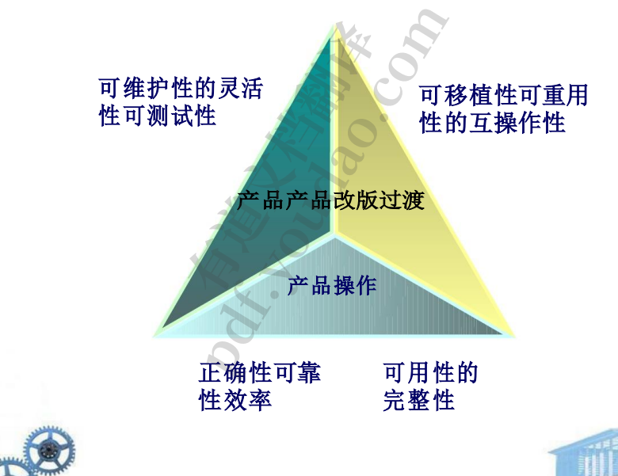

1. 软件质量
   1. 麦考尔的质量因素 :麦考尔和卡瓦诺(1978)
      1. 
      2. 功能、可靠性、可移植性、可用性、效率、可维护性
   2. 框架
      1. 度量和指标
         1. 
      2. 测量过程 
         1. ——制定。软件度量和度量的衍生。 
         2. ——收集。积累导出公式化指标所需的数据。 
         3. ——分析。度量的计算和数学工具的应用。 
         4. ——解释。对指标的评估结果是努力获得对表示质量的 洞察。 
         5. ——反馈。通过对产品指标的解读得出的建议传递给软件 团队。
      3. •测量原理 
         1. —度量标准应该具有理想的数学属性 
         2. -当一个度量表示一个软件特性，当积极的特性 发生时增加，或者当不良的特性出现时减少， 那么度量的值应该以同样的方式增加或减少 
         3. -在发布或用于决策之前，每个指标都应该在广泛的 环境中经过经验验证
      4. 收集和分析原则 
         1. -只要可能，数据收集和分析应该是自动化的
         2.  应应用有效的统计技术来建立产品内部属性和外 部质量特征之间的关系 
         3. 应该为每个指标建立解释性指南和建议
   3. 分析模型的指标
      1. •基于函数的度量
         1.  历史:面向规模的指标 
         2. 归一化值:代码行数(LOC) 每 KLOC 错误 每个人月 每 KLOC 缺陷 每 KLOC 每个人月 $每 LOC $每页文档 每 KLOC 文档页
         3.  依赖编程语言不利于设计良好但较短的程 序
      2. 基于函数的度量 
         1. 规范化值:功能点(FP)信息加权因子 
         2. 域值计数简单 Avg.复杂外部输入(EIs) X 3 4 6 =外部输出 (EOs) X 4 5 7 =外部查询(EQs) X 3 4 6 =内部逻辑文件(ILFs) X  7 10 15 =外部接口文件(EIFs) X 5 7 10 =计数总数
   4. 设计模型指标
      1. 
      2. 面向对象设计的指标
         1.  ——Class-Oriented 指标 
         2. The CK (Chidamber and Kemerer)度量套件 
         3. The  MOOD 度量套件 Lorenz and Kidd  Metrics 
         4. ——Operation-Oriented 指标 
            1. 平均运营规模(OS .avg) 
            2. 操作复杂度(OC) 
            3. 每次操作的平均参数数(NP .avg)
      3. 组件级设计指标 
         1. ——凝聚力
         2.  ——耦合
         3.  ——复杂性 
      4. •用户界面设计指标 
         1. ——布局是否合适 
         2.  UI 界面的内聚性
      5. 源代码指标
         1. 
         2.  测试指标 霍尔斯特德(Halstead)的测试工作量理 论•OO 可测试性 
         3. 维护指标 软件成熟度指数(SMI)
2. 过程和项目度量
   1. 
   2. 过程指标–过程的有效性
      1. 
   3. 项目指标–工作流程，实时方法
      1. 
   4. 过程度量准则 •
      1. 在解释指标数据时使用常识和组织敏感性。 定期向收集指标和指标的个人和团队提供反馈。
      2.  •不要用指标来评估个人。
         1.  与从业者和团队合作，制定明确的目标和指标，用于实现这些目标; 
         2. 永远不要用指标来威胁个人或团队。 
         3. 指示问题领域的指标数据不应被认为是负面的。这些数据仅仅 是流程改进的指标。
      3.  •不要沉迷于一个指标而排斥其他重要指标。
   5. 流程质量
      1. 质量相关 关注工作产品和可交付成果的质量 
      2. •Productivity -related -与所花费精力相关的工作产品的产量 
      3. 统计 SQA 数据 错误分类和分析 
      4. •缺陷去除效率 -错误从流程活动到活动的传播
      5.  •重用数据 -生产的组件数量及其可重用性程度
   6. 典型项目指标 
      1. 每个软件工程任务的工作量 /时间
      2.  每个评审小时未发现的错误 
      3. 计划的和实际的里程碑日期
      4.  变化 (数量 )及其特征 
      5. 软件工程任务上的工作分配
   7. ；类型的指标
      1. 面向规模的指标(LOC) •
      2. 面向功能的指标(FP) •
      3. 面向对象度量 -
         1. 场景脚本的数量 -
         2. 支持类的数量 
         3. -每个关键类的平均支持类数 数量的子系统 
      4. •WebApps 指标 -
         1. 静态网页的数量 
         2. -动态网页的数量
         3.  -内部页面链接数
         4.  -持久数据对象的个数 
         5. -接口的外部系统个数 
         6. -静态内容对象的数量 
         7. -动态内容对象的个数
3. 估计
   1. 是什么：
      1. 需要多长时间 ? 
      2. 需要做多少工作 ?
      3.  需要多少人参与 ?
      4.  •资源 (硬件 +软件)+风险
   2. 评估技术
      1. •过去 (类似的 )项目经验 •
         1. LOC 的编号
         2. .信息域内的选定值
         3. 用例的数量 
         4. .实现每个功能所需的人月
         5. 每项软件工程活动所需的人员月数
      2. 分解 •经验模型
         1. COCOMO(建设成本模型)II - E = [LOC x B0.333/P]3 x 
   3. 软件项目估算可以 从来不是一门精确的科学，而是 一门 好的历史数据的结合 系统的技术可以 提高估计精度。