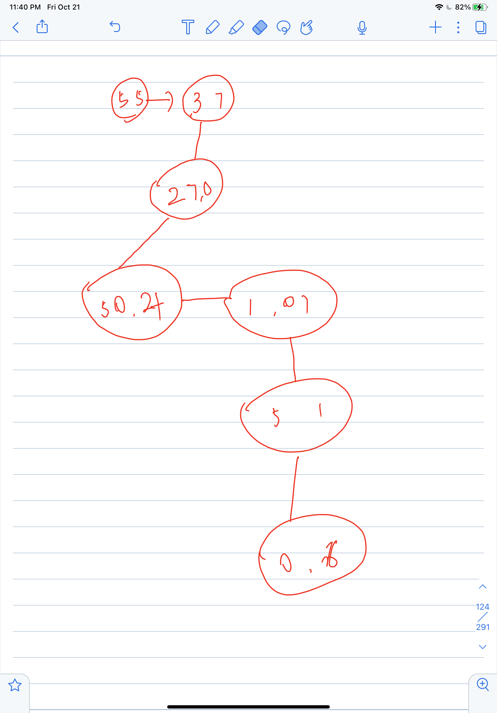

1. 一个杯子能装5l水，另一个杯子能装7l水，如何凑出6l水

   ==思路==：

   1. 首先明白该系统最多能装多少升水，即两杯都装水，5+7=12
   2. 也就是说，只要使小于12l的水都能装下
   3. 列出直接能量出的水：5L,7L,
      1. 同时 可以7-5=2 （7L水导入5L，剩余2L）
      2. 也可以5+5-7=3（大的能减小的，同时，小的也可以通过间接来减大的，先接满倒入大的，再倒满小的，在往大的倒，也就是剩余的为两小杯水减一大杯水）通过大杯间接存储小杯水来达到操作
      3. 即能得到 2 3 5 7 10
   4. 即步骤为：A -》B，A-》B，此时A（3l)，A-》B（B3L）,A->B,A(1l),
   5. 状态机
      1. 